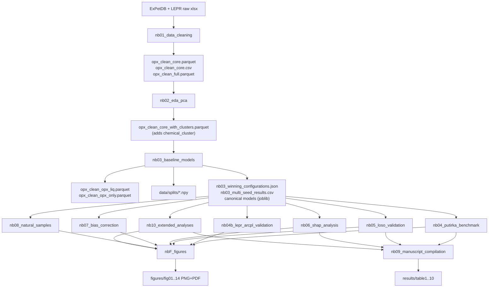
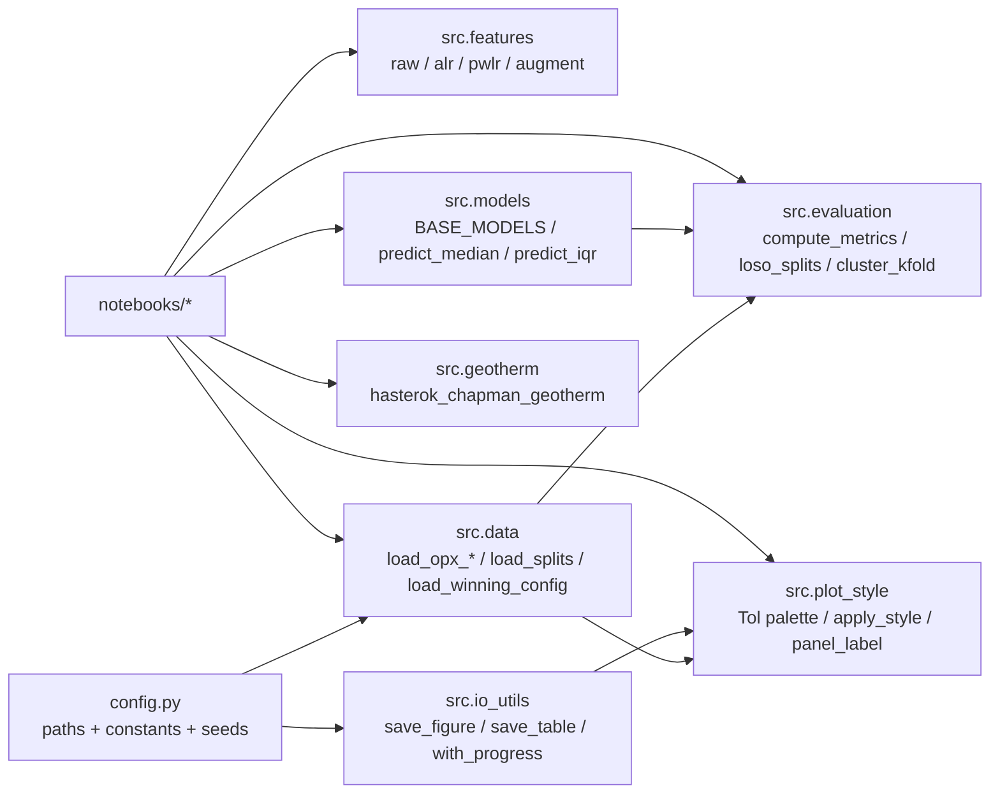

# Project overview

This document sketches the data flow and module topology of the opx ML
thermobarometer pipeline. For operational instructions (install, run order),
see [README.md](README.md).

## Data flow

## Module topology

## Invariants downstream of NB03

- `nb03_winning_configurations.json` names the global-winner feature set.
- `canonical_model_filename(model, target, track, RESULTS)` returns the
  correct joblib filename without requiring the caller to know which feature
  set won.
- `load_canonical_model(...)` loads it. No downstream notebook hardcodes
  `alr`, `pwlr`, or `raw` anywhere.
- `data/splits/test_indices_opx_liq.npy` and `test_indices_opx.npy` are the
  only test-set mapping used by every figure and metric.

## Robustness checks in NB06 (appendix)

Each check targets the concern that SHAP's dominant features might be proxies
for laboratory experimental design rather than genuine physicochemical
signal.

| Test                       | Expected outcome if model is sound            |
|----------------------------|-----------------------------------------------|
| Ablation of `liq_SiO2`+`liq_MgO`  | RMSE rises; magnitude bounds proxy risk       |
| Liquid-oxide vs target scatter | Monotonic trends indicate proxy risk       |
| Feature correlation heatmap | Strong cross-corr with target supports proxy |
| Y-randomization             | `R2 <= 0` after shuffle (sanity)             |
| Dummy regressor             | Baseline to beat                             |
| Perfect-signal injection    | Unconstrained model should nail it; constrained one may not |

## Validation strategies in NB05

| Strategy       | Group column          | Intuition                                       |
|----------------|-----------------------|-------------------------------------------------|
| LOSO           | `Citation`            | Generalization across laboratories / studies    |
| Cluster-KFold  | `chemical_cluster`    | Generalization across composition regions       |
| Gridded-PT     | `pt_grid` (T x P bin) | Generalization across the P-T plane             |

All three use pooled out-of-fold RMSE as the primary metric; per-fold RMSE is
saved for distribution diagnostics.
