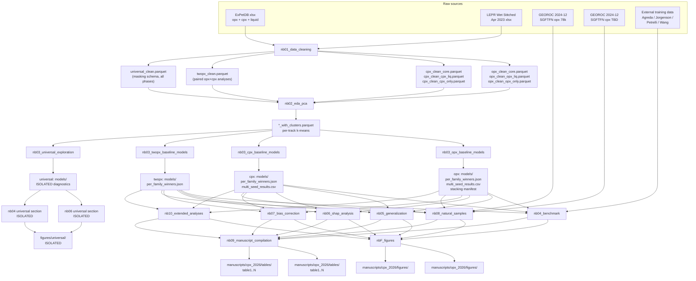
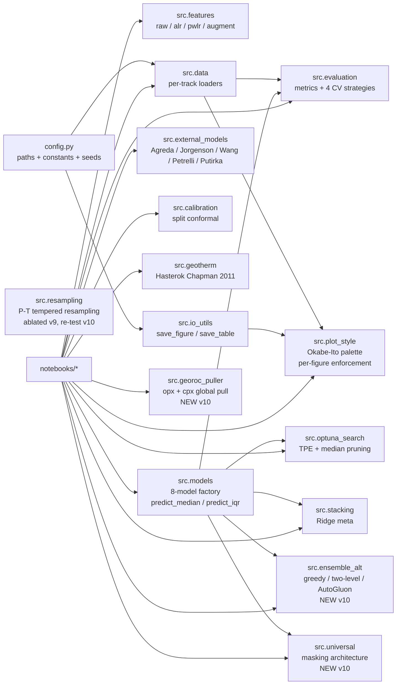

# Project overview

This document sketches the data flow and module topology of the pyroxene ML
thermobarometer pipeline. For operational instructions (install, run order),
see [README.md](README.md). For the current active plan, see
[`docs/v10_master_plan.md`](docs/v10_master_plan.md).

## Current status

**v9 complete (2026-04-16).** 23/23 pipeline health checks pass. Canonical
opx models on disk. External benchmarks against Putirka 2008, Agreda-Lopez
2024, Jorgenson 2022, and Wang 2021 complete on the ArcPL Kd-equilibrated
subset.

**Phase G.7 bias-correction mini-project (Option C, 2026-04-18).** Unified
`src/prepare_train_test.py` dispatcher (A1, 34-test parity suite vs the
archived opx adapters). `src/bias_correction.py` with Form A (per-regime
OLS) + Form B (quantile-thresholded piecewise) + ship-if-better decision
on overall Delta-RMSE and no-regime-degrades. D2 driver over 8 aggregate-
best cells (opx-liq, opx-only, cpx-liq, cpx-only × T_C, P_kbar) × 20
seeds with per-seed pickle checkpoints. A4 bin-edge sensitivity (+/-1
kbar on inner edges). A5 Form B CV-reseed stability (5 CV seeds). D3/D3b
post-correction scorecards and GEOROC natural opx inference. D4 figures
30-34. D5 tables T4 (main) + S9/S10 (supplementary). D7 manuscript
autofill. Tests T16-T18 register Phase G.7 decisions in the NB03 test
log. Twopx and universal pipelines excluded from this mini-project.

**v10+v11 planning complete (2026-04-16).** 13 planning documents written.
Phase A execution pending user approval. See
[`docs/v10_master_plan.md`](docs/v10_master_plan.md) for the unified plan
covering:

- Two-paper ambition: opx paper 2026, cpx paper 2027, one repo
- Five pipelines: opx_only, opx_liq, cpx_only, cpx_liq, twopx
- Universal masking model (isolated side project, potential third paper)
- 8-model roster (RF, ERT, XGB, GB + CatBoost, LightGBM, ElasticNet, MLP)
- 4 ensemble method comparison (Ridge, two-level, greedy Caruana, AutoGluon)
- 14-notebook structure (nb03 split 4 ways; nb04+nbM merged; nb07+nb07b
  merged; nb08+nb08b merged)
- Test-first rebuild protocol (T01-T14, per-pipeline ship/ablate)
- World maps for natural samples (static + interactive, two panels per
  mineral)
- Manuscript narrative corrections per v9 empirical findings:
  - Boosted (XGB) is primary, not stacked (stacked collapsed on test)
  - P bias correction is SIGNIFICANT on test, not NULL
  - ArcPL T bias +48.5 C forest, +20.9 C boosted (boosted is headline)

## Data flow (v10 target)

```mermaid
flowchart TD
    subgraph RAW_DATA["Raw sources"]
        EXPETDB["ExPetDB xlsx<br/>opx + cpx + liquid"]
        LEPR["LEPR Wet Stitched<br/>Apr 2023 xlsx"]
        GEOROC_OPX["GEOROC 2024-12<br/>SGFTFN opx 78k"]
        GEOROC_CPX["GEOROC 2024-12<br/>SGFTFN cpx TBD"]
        EXT_TRAIN["External training data<br/>Agreda / Jorgenson /<br/>Petrelli / Wang"]
    end

    EXPETDB --> NB01[nb01_data_cleaning]
    LEPR --> NB01

    NB01 --> OPX_CLEAN["opx_clean_core.parquet<br/>opx_clean_opx_liq.parquet<br/>opx_clean_opx_only.parquet"]
    NB01 --> CPX_CLEAN["cpx_clean_core.parquet<br/>cpx_clean_cpx_liq.parquet<br/>cpx_clean_cpx_only.parquet"]
    NB01 --> TWOPX_CLEAN["twopx_clean.parquet<br/>(paired opx+cpx analyses)"]
    NB01 --> UNIVERSAL_CLEAN["universal_clean.parquet<br/>(masking schema, all phases)"]

    OPX_CLEAN --> NB02[nb02_eda_pca]
    CPX_CLEAN --> NB02
    TWOPX_CLEAN --> NB02
    UNIVERSAL_CLEAN --> NB02

    NB02 --> CLUSTERED["*_with_clusters.parquet<br/>per-track k-means"]

    CLUSTERED --> NB03_OPX[nb03_opx_baseline_models]
    CLUSTERED --> NB03_CPX[nb03_cpx_baseline_models]
    CLUSTERED --> NB03_TWOPX[nb03_twopx_baseline_models]
    CLUSTERED --> NB03_UNIV[nb03_universal_exploration]

    NB03_OPX --> WIN_OPX["opx: models/<br/>per_family_winners.json<br/>multi_seed_results.csv<br/>stacking manifest"]
    NB03_CPX --> WIN_CPX["cpx: models/<br/>per_family_winners.json<br/>multi_seed_results.csv"]
    NB03_TWOPX --> WIN_TWOPX["twopx: models/<br/>per_family_winners.json"]
    NB03_UNIV --> WIN_UNIV["universal: models/<br/>ISOLATED diagnostics"]

    WIN_OPX --> NB04[nb04_benchmark]
    WIN_CPX --> NB04
    WIN_TWOPX --> NB04
    EXT_TRAIN --> NB04

    WIN_OPX --> NB05[nb05_generalization]
    WIN_CPX --> NB05
    WIN_TWOPX --> NB05

    WIN_OPX --> NB06[nb06_shap_analysis]
    WIN_CPX --> NB06
    WIN_TWOPX --> NB06

    WIN_OPX --> NB07[nb07_bias_correction]
    WIN_CPX --> NB07
    WIN_TWOPX --> NB07

    GEOROC_OPX --> NB08[nb08_natural_samples]
    GEOROC_CPX --> NB08
    WIN_OPX --> NB08
    WIN_CPX --> NB08
    WIN_TWOPX --> NB08

    WIN_OPX --> NB10[nb10_extended_analyses]
    WIN_CPX --> NB10
    WIN_TWOPX --> NB10

    NB04 --> FIG[nbF_figures]
    NB05 --> FIG
    NB06 --> FIG
    NB07 --> FIG
    NB08 --> FIG
    NB10 --> FIG

    WIN_UNIV --> NB06_UNIV["nb06 universal section<br/>ISOLATED"]
    WIN_UNIV --> NB04_UNIV["nb04 universal section<br/>ISOLATED"]
    NB06_UNIV --> FIG_UNIV["figures/universal/<br/>ISOLATED"]
    NB04_UNIV --> FIG_UNIV

    NB04 --> NB09[nb09_manuscript_compilation]
    NB05 --> NB09
    NB06 --> NB09
    NB07 --> NB09
    NB08 --> NB09
    NB10 --> NB09

    NB09 --> TABLES_OPX["manuscripts/opx_2026/tables/<br/>table1..N"]
    NB09 --> TABLES_CPX["manuscripts/cpx_2026/tables/<br/>table1..N"]
    FIG --> FIG_OPX["manuscripts/opx_2026/figures/"]
    FIG --> FIG_CPX["manuscripts/cpx_2026/figures/"]
```

## Pipeline isolation

The universal model is intentionally disconnected from the opx/cpx/twopx
primary pipelines. Its diagnostics, figures, and SHAP analyses live in
separate directories (`results/universal/`, `figures/universal/`) and never
combine with the primary results. This protects the opx and cpx papers from
contamination by an exploratory architecture while keeping the exploration
under version control. See
[`docs/v10_universal_model_exploration.md`](docs/v10_universal_model_exploration.md)
for the isolation protocol.

## Module topology

```mermaid
flowchart LR
    CONFIG[config.py<br/>paths + constants + seeds]
    FEATURES[src.features<br/>raw / alr / pwlr / augment]
    MODELS[src.models<br/>8-model factory<br/>predict_median / predict_iqr]
    DATA[src.data<br/>per-track loaders]
    EVAL[src.evaluation<br/>metrics + 4 CV strategies]
    EXT[src.external_models<br/>Agreda / Jorgenson / Wang / Petrelli / Putirka]
    OPTUNA[src.optuna_search<br/>TPE + median pruning]
    RESAMPLE[src.resampling<br/>P-T tempered resampling<br/>ablated v9, re-test v10]
    STACK[src.stacking<br/>Ridge meta]
    ENSEMBLE_ALT[src.ensemble_alt<br/>greedy / two-level / AutoGluon<br/>NEW v10]
    CALIB[src.calibration<br/>split conformal]
    GEO[src.geotherm<br/>Hasterok Chapman 2011]
    IO[src.io_utils<br/>save_figure / save_table]
    PLOT[src.plot_style<br/>Okabe-Ito palette<br/>per-figure enforcement]
    UNIV[src.universal<br/>masking architecture<br/>NEW v10]
    GEOROC[src.georoc_puller<br/>opx + cpx global pull<br/>NEW v10]

    CONFIG --> DATA
    CONFIG --> IO
    DATA --> EVAL
    DATA --> PLOT
    MODELS --> EVAL
    MODELS --> OPTUNA
    MODELS --> STACK
    MODELS --> ENSEMBLE_ALT
    MODELS --> UNIV
    IO --> PLOT

    NB[notebooks/*] --> FEATURES
    NB --> MODELS
    NB --> DATA
    NB --> EVAL
    NB --> EXT
    NB --> OPTUNA
    NB --> STACK
    NB --> ENSEMBLE_ALT
    NB --> CALIB
    NB --> GEO
    NB --> PLOT
    NB --> UNIV
    NB --> GEOROC
```

## Invariants downstream of NB03

These invariants are enforced in v9 for opx and extended in v10 to all five
pipelines:

- `nb03_{track}_per_family_winners.json` names the canonical winners for
  every family in the pipeline (tree / boosted / linear / NN / stacked).
- `canonical_model_filename(target, track, family, RESULTS)` returns the
  correct joblib filename without requiring the caller to know which feature
  set won.
- `load_canonical_model(...)` loads it. No downstream notebook hardcodes
  `alr`, `pwlr`, or `raw` anywhere.
- `load_stacked_model(target, track, meta_type)` returns a predictor that
  runs the full pipeline base -> meta for any of the four ensemble methods
  tested in v10 (Ridge, two-level, greedy, AutoGluon). Meta type persisted
  in the winners JSON.
- `data/splits/test_indices_{track}.npy` is the only test-set mapping used
  by every figure and metric for that track.

## Validation strategies in NB05 (v10 adds LeaveOneRegionOut)

| Strategy | Group column | Intuition |
|---|---|---|
| LOSO | `Citation` | Generalization across laboratories |
| Cluster-KFold | `chemical_cluster` | Generalization across composition regions |
| TargetBinKFold | `pt_grid` (T x P bin) | Generalization across the P-T plane |
| LeaveOneRegionOut | `tectonic_setting` | Generalization across geodynamic regimes (v10 new) |

All four use pooled out-of-fold RMSE as the primary metric; per-fold RMSE is
saved for distribution diagnostics.

## Robustness checks in NB06 (appendix)

Each check targets the concern that SHAP's dominant features might be
proxies for laboratory experimental design rather than genuine
physicochemical signal. All pipelines receive these checks.

| Test | Expected outcome if model is sound |
|---|---|
| Ablation of `liq_SiO2`+`liq_MgO` (opx) | RMSE rises; magnitude bounds proxy risk |
| Ablation of top-3 SHAP features (cpx, twopx) | RMSE rises |
| Liquid-oxide vs target scatter | Monotonic trends indicate proxy risk |
| Feature correlation heatmap | Strong cross-corr with target supports proxy |
| Y-randomization | `R^2 <= 0` after shuffle (sanity) |
| Dummy regressor | Baseline to beat |
| Perfect-signal injection | Unconstrained model should nail it |

## What the v9 audit revealed

See [`docs/v10_master_plan.md`](docs/v10_master_plan.md) Section 1.3 for
the full list of handoff corrections. Short summary:

1. Stacking won ArcPL but lost test set (alpha endpoint=100 on all 4
   targets). Handoff claimed a clean win.
2. P piecewise bias correction is SIGNIFICANT (CI excludes zero,
   delta = -0.27 kbar). Handoff said NULL.
3. `nb10_two_pyroxene_benchmark.csv` is empty. Handoff said NB10 executed
   in full.
4. ArcPL T bias +48.5 C for forest, +20.9 C for boosted. Handoff carried
   over +37 C from v8.
5. `CANONICAL_FIGURES` list in `config.py` is stale (stems do not match
   actual files).
6. We do NOT beat Putirka on T (wash at best). Handoff overclaimed. Correct
   framing: match on T, beat on P, lose to cpx models.

All corrections flow through the v10 master plan and the updated strategy
documents.

## Execution readiness

Approval gate per `docs/v10_master_plan.md` Section 11. Once approved,
Phase A begins: cleanup + external models audit + manuscript directory
skeletons. Compute estimates are preliminary based on v9 actual timing
(48 Optuna studies in 2.12 h on i7-1265U); full matrix estimated ~26 h
compute spread across overnight runs. Active development estimated
4-6 weeks across all phases.
